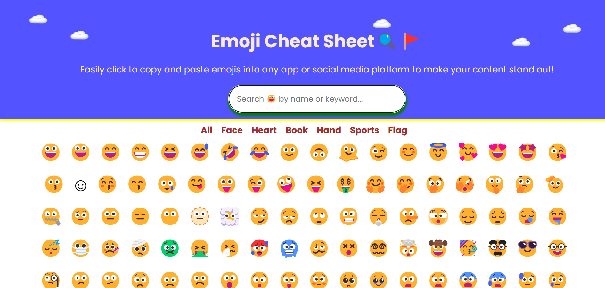

# Emoji Collection Project

## Project Overview
This project displays a collection of emojis, making it fun and easy to explore different emojis in one place. Users can also search for specific emojis using the built-in search feature, ensuring a simple and engaging user experience.

## Features
- **Emoji Display:** Showcases a wide variety of emojis.
- **Search Functionality:** Allows users to search and filter emojis in real-time based on keywords.
- **Responsive Design:** Adapts smoothly across devices, providing an optimal experience on both desktop and mobile.

## Technology Stack
- **HTML5** and **CSS3** for structuring and styling the UI.
- **JavaScript** for handling search functionality and user interactions.

## How to Use
1. Enter a keyword into the search bar to filter emojis by name or category.
2. The collection updates in real-time to display matching results.
