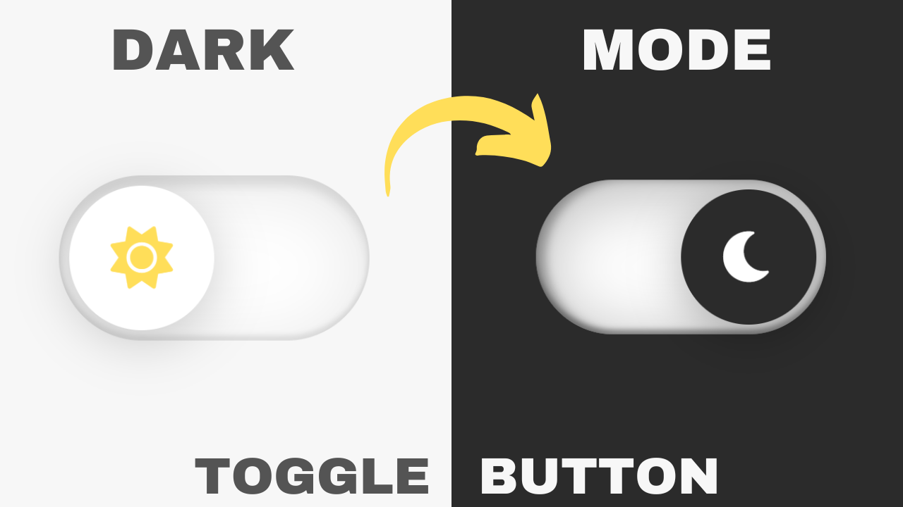

# Dark Mode Toggle Button

A simple and stylish dark mode toggle button that lets users switch between light and dark themes. This project demonstrates the use of HTML, CSS, and JavaScript to create an interactive UI component.

## Preview

## Features

- **Toggle Animation**: Smooth transition between light and dark modes.
- **Sun and Moon Icons**: The button displays a sun icon for light mode and a moon icon for dark mode.
- **Light and Dark Themes**: Background and text colors change based on the selected mode.
  
## Technologies Used

- **HTML**: Basic structure and elements.
- **CSS**: Styling and animations.
- **JavaScript**: Logic to toggle between light and dark modes.

## How It Works

- The button consists of two states: light mode and dark mode.
- When clicked, JavaScript toggles a class on the button to switch the theme.
- CSS applies the appropriate colors and icons for each theme.
  
## Usage

1. Clone the repository.
2. Open `index.html` in a web browser.
3. Click the toggle button to switch between light and dark themes.

## Future Improvements

- Add more theme options.
- Implement user preference storage using local storage.

