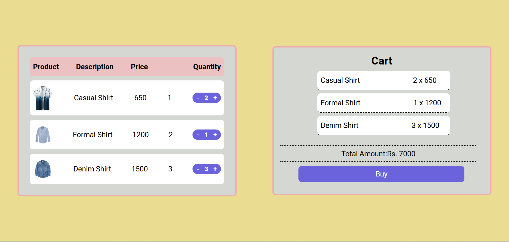

# Shopping Cart Project

## Introduction
This project is a simple shopping cart application The interface consists of a two-column layout where users can view products on the left and add selected items to the cart on the right. The cart dynamically updates as items are added or removed, providing a seamless shopping experience.

## Features
1. **Product List**: Displays a list of available products, each with a name, image, price, and quantity controls.
2. **Cart**: Shows the list of products added to the cart along with the quantity and total price.
3. **Add & Remove Buttons**: Users can adjust quantities of items with `+` and `-` buttons.
4. **Real-Time Price Calculation**: Updates the total price in real-time as products are added or removed.
5. **Empty Cart Notification**: Displays "No Product added to the cart" when the cart is empty.

## Technologies Used
- **React**: Utilized for component-based architecture and `useState` for state management.
- **JavaScript (ES6+)**: Modern syntax including arrow functions and destructuring.
- **CSS**: Basic styling for layout and color themes.

## Project Structure
- **App.js**: Main component that handles state management and passes props to `ProductList` and `Cart`.
- **ProductList.js**: Contains the list of products with quantity control buttons.
- **Cart.js**: Displays the cart with items added, total price, and cart status.

